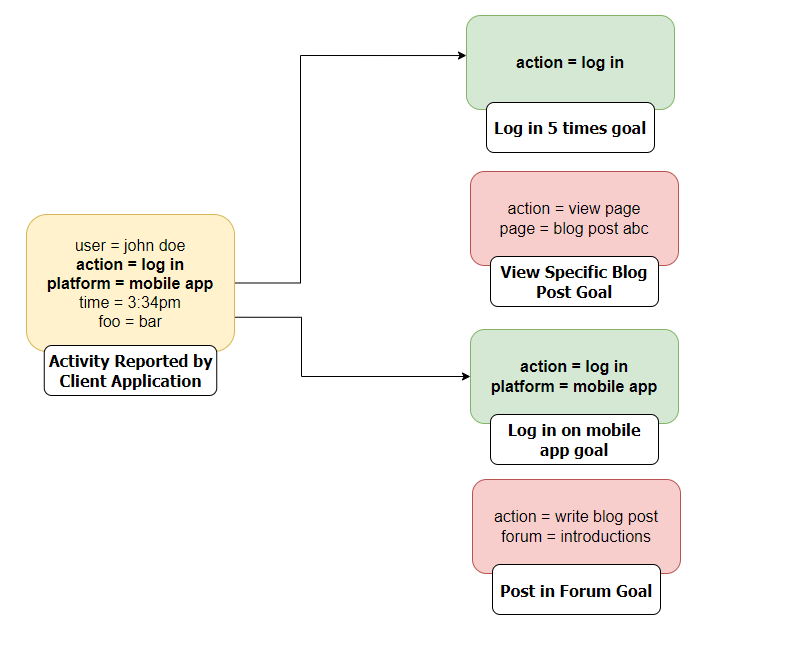
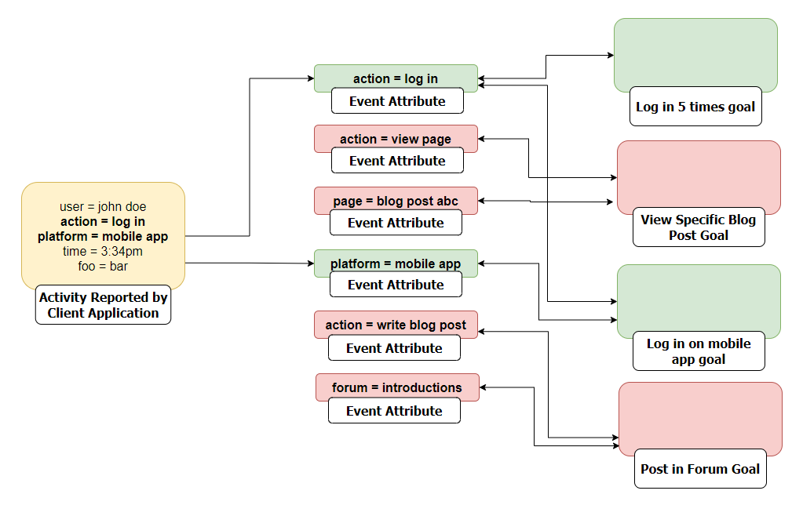

# jz-gamification-engine system architecture

## System Architecture

Currently jz-gamification-engine is comprised of two parts:

1. a NodeJS backend which exposes REST APIs for goals, events, and goal progress
2. a Neo4j database which persists data and facilitate the event matching algorithm

In order to decouple the gamification engine from client applications, clients do not directly reference goals or criteria when reporting activity. This design decision promotes isolation and scalability by keeping most gamification-specific logic out of the client application. 

This design will also eventually allow clients to reuse existing infrastructure (e.g. event brokers) to broadcast goal-related activity without having to issue requests directly against the gamification engine. A short term goal of the project is to support the reading of goal activity from event brokers like Kafka.

## Data Model

A graph is used for the primary data model.

- **Goals** have one or more **criteria**
- **Criteria** have one or more **event attributes**
- **Entities (e.g. users)** make progress towards **criteria**
- **Entities** complete **goals** once all **criteria** have been satisfied

The design decision to have clients not directly reference goals or criteria when reporting activity does incur a performance cost. The greatest traffic the engine will receive is client applications reporting user activity that may contribute towards a user completing a goal. Since specific goals and criteria are not known when activity is reported, the engine must identify all goals criteria satisfied given only the key/value combos on the inbound activity payload. 

The image below illustrates the problem. When activity is reported but no goal ids are referenced, how do we know which goals (if any) to update a user's progress against?

jz-gamification-engine solves this problem by decomposing the individual attributes within a goal into their own entities. When activity is reported, the engine looks for all goals whose *entire* set of event attributes are a subset of the attributes of the received activity payload. 

Here is the solution visualized:

A graph data model supports this lookup given its ability to perform operations on the relationships/edges between nodes efficiently.