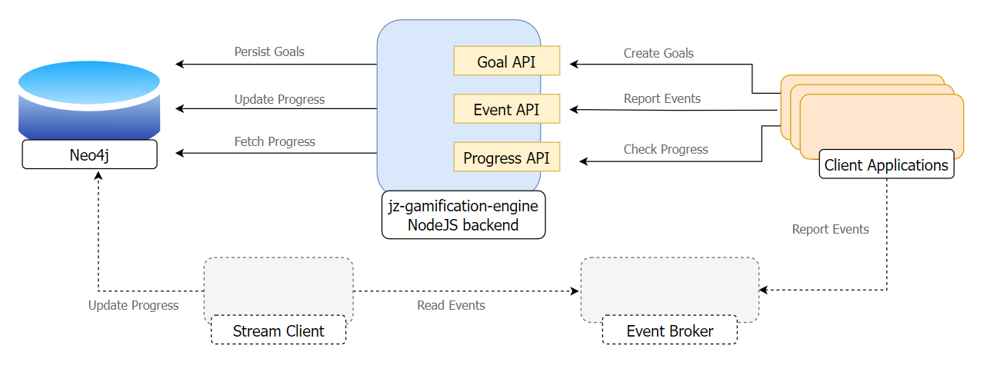
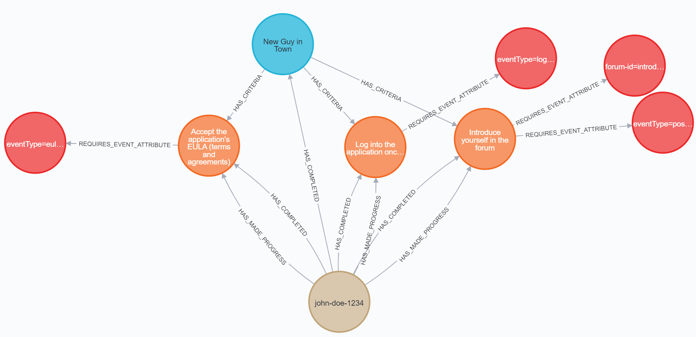

# jz-gamification-engine system architecture

## System Architecture

Currently jz-gamification-engine is comprised of two parts:

1. a NodeJS backend which exposes REST APIs for goals, events, and goalProgress
2. a Neo4j database which persists data and facilitate the event matching algorithm

A short term goal is to support reading goal activity from event brokers like Kafka in order to expedite onboarding and discourage direct application coupling.

## Data Model

A graph data model is used to capture all of the engine's logic.

- **Goals** have one or more **criteria**
- **Criteria** have one or more **event attributes**
- **Entities (e.g. users)** make progress towards **criteria**
- **Entities** complete **goals** once all **criteria** have been satisfied

The decision to use a graph data model was largely driven by performance concerns. The greatest traffic this engine will receive is when client applications report user activity and the engine has to determine what goals (if any) that activity applies to. Furthermore, in order to decouple the gamification engine from client apps, clients do not have to reference any existing goals, criteria, or users in the events that they send. This will allow clients to reuse existing infrastructure (e.g. event brokers) to broadcast events without having to issue requests directly against the gamification engine.

This use case required a model that facilitated very quick lookups. (TODO FINISH THIS)